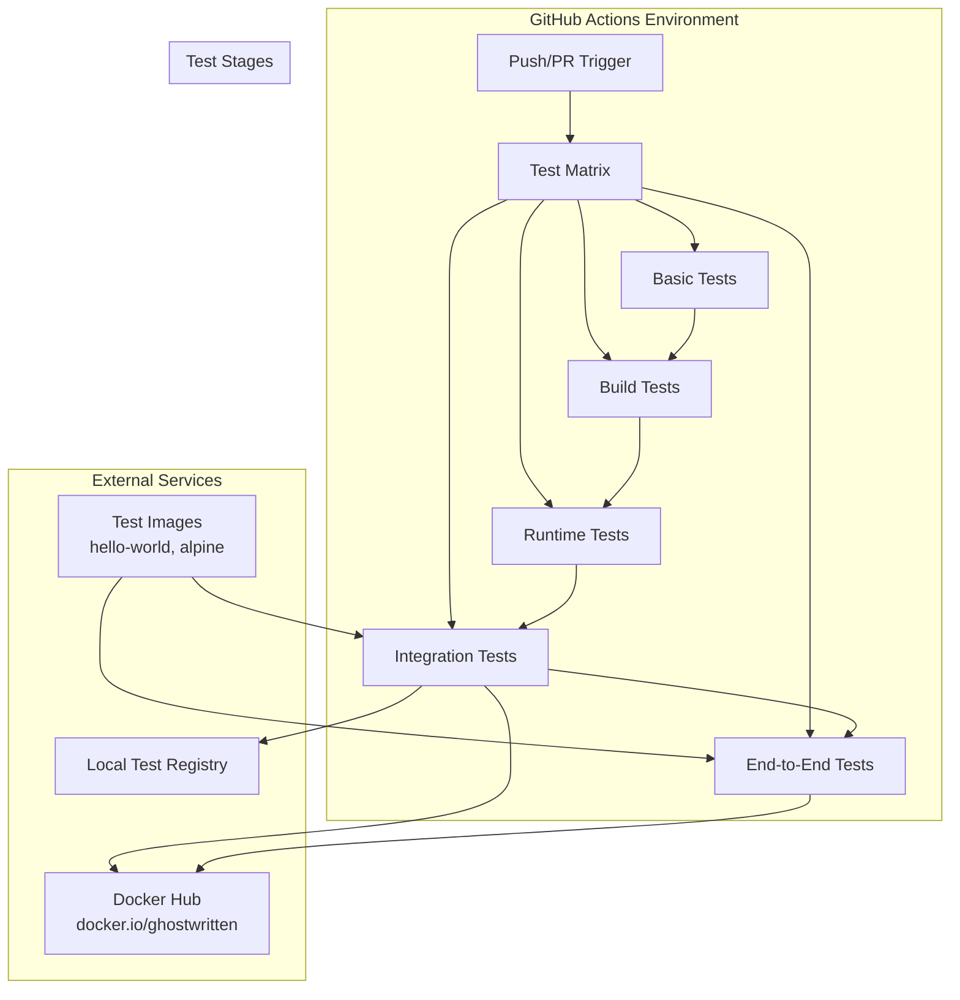
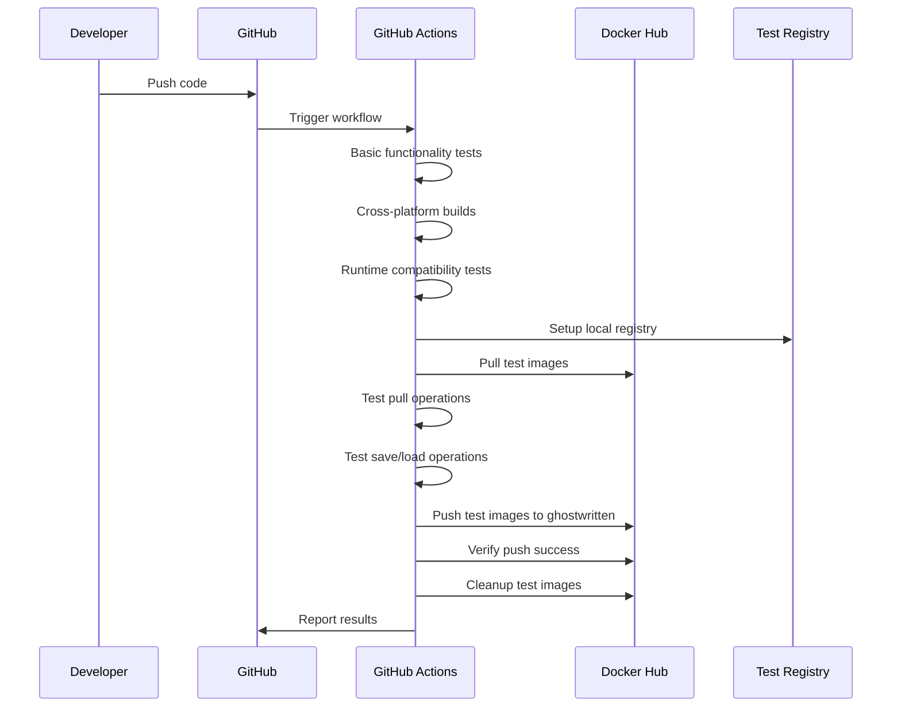

# Design Document

## Overview

本设计文档描述了如何改进GitHub Actions测试流程，使其能够在云端环境中进行完整的容器镜像操作测试。设计重点是创建一个全面的CI/CD测试管道，支持真实的镜像仓库操作，包括推送到用户的公共仓库 `docker.io/ghostwritten`。这将显著减少本地测试的资源消耗，同时提供更真实的测试环境。

## Architecture

### 测试架构概览



### 测试流水线设计



## Components and Interfaces

### 1. 测试矩阵配置

```yaml
strategy:
  matrix:
    os: [ubuntu-latest, macos-latest, windows-latest]
    go-version: ['1.21', '1.22']
    test-type: [basic, integration, e2e]
    include:
      - os: ubuntu-latest
        container-runtime: docker
      - os: ubuntu-latest  
        container-runtime: podman
    exclude:
      - os: windows-latest
        test-type: e2e  # Skip E2E on Windows due to container limitations
```

### 2. 认证和密钥管理

```yaml
# GitHub Secrets 配置
secrets:
  DOCKER_HUB_USERNAME: ghostwritten
  DOCKER_HUB_TOKEN: ${{ secrets.DOCKER_HUB_TOKEN }}
  
# 环境变量配置
env:
  REGISTRY: docker.io
  NAMESPACE: ghostwritten
  TEST_TAG_PREFIX: hpn-test
  CLEANUP_AFTER_TEST: true
```

### 3. 测试镜像策略

```yaml
# 测试镜像分类
test_images:
  lightweight:
    - hello-world:latest
    - alpine:3.18
    - busybox:1.36
  
  medium:
    - nginx:alpine
    - redis:7-alpine
    
  push_test:
    - docker.io/ghostwritten/hpn-test-hello:latest
    - docker.io/ghostwritten/hpn-test-alpine:latest
```

### 4. 并行测试配置

```go
type TestConfig struct {
    MaxParallel    int           `yaml:"max_parallel"`
    Timeout        time.Duration `yaml:"timeout"`
    RetryAttempts  int           `yaml:"retry_attempts"`
    CleanupPolicy  string        `yaml:"cleanup_policy"`
}

type TestSuite struct {
    Name        string      `yaml:"name"`
    Images      []string    `yaml:"images"`
    Operations  []string    `yaml:"operations"`
    Parallel    int         `yaml:"parallel"`
    Config      TestConfig  `yaml:"config"`
}
```

## Data Models

### 测试结果数据模型

```go
type TestResult struct {
    TestName     string            `json:"test_name"`
    Status       TestStatus        `json:"status"`
    Duration     time.Duration     `json:"duration"`
    Platform     PlatformInfo      `json:"platform"`
    Runtime      RuntimeInfo       `json:"runtime"`
    Operations   []OperationResult `json:"operations"`
    Errors       []TestError       `json:"errors,omitempty"`
    Metrics      TestMetrics       `json:"metrics"`
}

type TestStatus string

const (
    TestStatusPassed  TestStatus = "passed"
    TestStatusFailed  TestStatus = "failed"
    TestStatusSkipped TestStatus = "skipped"
    TestStatusTimeout TestStatus = "timeout"
)

type PlatformInfo struct {
    OS           string `json:"os"`
    Architecture string `json:"architecture"`
    GoVersion    string `json:"go_version"`
    Runner       string `json:"runner"`
}

type RuntimeInfo struct {
    Name     string `json:"name"`
    Version  string `json:"version"`
    Available bool  `json:"available"`
}

type TestMetrics struct {
    ImagesProcessed int           `json:"images_processed"`
    DataTransferred int64         `json:"data_transferred"`
    PeakMemoryUsage int64         `json:"peak_memory_usage"`
    NetworkCalls    int           `json:"network_calls"`
    ParallelJobs    int           `json:"parallel_jobs"`
}
```

### 镜像管理数据模型

```go
type TestImage struct {
    Registry    string            `json:"registry"`
    Namespace   string            `json:"namespace"`
    Repository  string            `json:"repository"`
    Tag         string            `json:"tag"`
    FullName    string            `json:"full_name"`
    Size        int64             `json:"size,omitempty"`
    Digest      string            `json:"digest,omitempty"`
    TestPurpose TestImagePurpose  `json:"test_purpose"`
    Cleanup     bool              `json:"cleanup"`
}

type TestImagePurpose string

const (
    PurposePullTest  TestImagePurpose = "pull_test"
    PurposeSaveTest  TestImagePurpose = "save_test"
    PurposeLoadTest  TestImagePurpose = "load_test"
    PurposePushTest  TestImagePurpose = "push_test"
    PurposeE2ETest   TestImagePurpose = "e2e_test"
)
```

## Error Handling

### 错误分类和处理策略

```go
type TestError struct {
    Code        ErrorCode         `json:"code"`
    Message     string            `json:"message"`
    Category    ErrorCategory     `json:"category"`
    Severity    ErrorSeverity     `json:"severity"`
    Context     map[string]string `json:"context"`
    Suggestion  string            `json:"suggestion,omitempty"`
    Retryable   bool              `json:"retryable"`
}

type ErrorCategory string

const (
    CategoryNetwork     ErrorCategory = "network"
    CategoryAuth        ErrorCategory = "authentication"
    CategoryRuntime     ErrorCategory = "runtime"
    CategoryFileSystem  ErrorCategory = "filesystem"
    CategoryConfig      ErrorCategory = "configuration"
    CategoryTimeout     ErrorCategory = "timeout"
)

type ErrorSeverity string

const (
    SeverityInfo     ErrorSeverity = "info"
    SeverityWarning  ErrorSeverity = "warning"
    SeverityError    ErrorSeverity = "error"
    SeverityCritical ErrorSeverity = "critical"
)
```

### 重试机制设计

```yaml
retry_policies:
  network_operations:
    max_attempts: 3
    initial_delay: 1s
    max_delay: 30s
    backoff_factor: 2.0
    retryable_errors:
      - "connection timeout"
      - "temporary failure"
      - "rate limit exceeded"
  
  registry_operations:
    max_attempts: 5
    initial_delay: 2s
    max_delay: 60s
    backoff_factor: 1.5
    retryable_errors:
      - "registry unavailable"
      - "authentication token expired"
      - "push rate limit"
```

## Testing Strategy

### 1. 基础功能测试 (Basic Tests)

```yaml
basic_tests:
  - name: version_commands
    commands:
      - ./hpn --version
      - ./hpn -v
      - ./hpn -V
      - ./hpn version
    
  - name: help_commands
    commands:
      - ./hpn --help
      - ./hpn -h
      
  - name: error_handling
    commands:
      - ./hpn  # Should show error
      - ./hpn -a invalid  # Should show error
    expect_failure: true
```

### 2. 构建测试 (Build Tests)

```yaml
build_tests:
  platforms:
    - linux/amd64
    - linux/arm64
    - darwin/amd64
    - darwin/arm64
    - windows/amd64
  
  validation:
    - binary_exists: true
    - version_output: true
    - help_output: true
    - file_size_reasonable: true
```

### 3. 运行时兼容性测试 (Runtime Tests)

```yaml
runtime_tests:
  docker:
    setup: |
      # Docker is pre-installed in GitHub Actions
      docker --version
    tests:
      - runtime_detection
      - pull_operation
      - save_operation
      - load_operation
      
  podman:
    setup: |
      # Install Podman on Ubuntu
      sudo apt-get update
      sudo apt-get install -y podman
    tests:
      - runtime_detection
      - pull_operation
      - basic_operations
```

### 4. 集成测试 (Integration Tests)

```yaml
integration_tests:
  local_registry:
    setup: |
      # Start local registry for testing
      docker run -d -p 5000:5000 --name registry registry:2
    tests:
      - push_to_local_registry
      - pull_from_local_registry
      - round_trip_test
      
  docker_hub:
    setup: |
      # Login to Docker Hub
      echo $DOCKER_HUB_TOKEN | docker login -u $DOCKER_HUB_USERNAME --password-stdin
    tests:
      - push_to_public_registry
      - verify_push_success
      - cleanup_test_images
```

### 5. 端到端测试 (E2E Tests)

```yaml
e2e_tests:
  complete_workflow:
    steps:
      - name: pull_test_images
        images: [hello-world:latest, alpine:3.18]
        
      - name: save_images_mode1
        mode: current_directory
        
      - name: save_images_mode2
        mode: images_directory
        
      - name: load_images_mode1
        mode: current_directory
        
      - name: load_images_mode2
        mode: images_directory
        
      - name: tag_for_push
        target_registry: docker.io/ghostwritten
        
      - name: push_images
        registry: docker.io/ghostwritten
        cleanup: true
        
  parallel_operations:
    concurrency_levels: [1, 3, 5]
    image_counts: [5, 10, 20]
    operations: [pull, save, load]
```

## Performance Considerations

### 并行处理优化

```go
type ParallelTestConfig struct {
    MaxWorkers      int           `yaml:"max_workers"`
    WorkerTimeout   time.Duration `yaml:"worker_timeout"`
    QueueSize       int           `yaml:"queue_size"`
    ResourceLimits  ResourceLimits `yaml:"resource_limits"`
}

type ResourceLimits struct {
    MaxMemoryMB     int `yaml:"max_memory_mb"`
    MaxDiskSpaceMB  int `yaml:"max_disk_space_mb"`
    MaxNetworkMbps  int `yaml:"max_network_mbps"`
}
```

### 缓存策略

```yaml
cache_strategy:
  go_modules:
    key: ${{ runner.os }}-go-${{ hashFiles('**/go.sum') }}
    paths: ~/go/pkg/mod
    
  docker_layers:
    key: ${{ runner.os }}-docker-${{ hashFiles('test-images.txt') }}
    paths: /tmp/.buildx-cache
    
  test_artifacts:
    key: ${{ runner.os }}-test-${{ github.sha }}
    paths: 
      - ./test-results
      - ./coverage-reports
```

## Security Considerations

### 认证管理

```yaml
security_measures:
  secrets_management:
    - use_github_secrets: true
    - rotate_tokens_regularly: true
    - limit_token_permissions: true
    
  registry_access:
    - use_read_only_tokens_when_possible: true
    - implement_cleanup_after_tests: true
    - avoid_sensitive_data_in_logs: true
    
  network_security:
    - use_https_only: true
    - validate_registry_certificates: true
    - implement_timeout_limits: true
```

### 镜像安全

```go
type SecurityPolicy struct {
    AllowedRegistries   []string          `yaml:"allowed_registries"`
    MaxImageSize        int64             `yaml:"max_image_size"`
    ScanImages          bool              `yaml:"scan_images"`
    CleanupPolicy       CleanupPolicy     `yaml:"cleanup_policy"`
    AccessControls      AccessControls    `yaml:"access_controls"`
}

type CleanupPolicy struct {
    AutoCleanup         bool              `yaml:"auto_cleanup"`
    RetentionPeriod     time.Duration     `yaml:"retention_period"`
    MaxTestImages       int               `yaml:"max_test_images"`
}
```

## Deployment and Distribution

### GitHub Actions工作流配置

```yaml
# .github/workflows/enhanced-test.yml
name: Enhanced Testing

on:
  push:
    branches: [main, develop]
  pull_request:
    branches: [main]
  schedule:
    - cron: '0 2 * * *'  # Daily at 2 AM UTC

env:
  REGISTRY: docker.io
  NAMESPACE: ghostwritten
  GO_VERSION: '1.21'

jobs:
  test-matrix:
    strategy:
      fail-fast: false
      matrix:
        include:
          - os: ubuntu-latest
            test-suite: basic
          - os: ubuntu-latest
            test-suite: integration
          - os: ubuntu-latest
            test-suite: e2e
          - os: macos-latest
            test-suite: basic
          - os: windows-latest
            test-suite: basic
```

### 测试报告生成

```go
type TestReport struct {
    Summary         TestSummary       `json:"summary"`
    Results         []TestResult      `json:"results"`
    Performance     PerformanceReport `json:"performance"`
    Coverage        CoverageReport    `json:"coverage"`
    Recommendations []string          `json:"recommendations"`
    GeneratedAt     time.Time         `json:"generated_at"`
}

type TestSummary struct {
    TotalTests      int               `json:"total_tests"`
    PassedTests     int               `json:"passed_tests"`
    FailedTests     int               `json:"failed_tests"`
    SkippedTests    int               `json:"skipped_tests"`
    Duration        time.Duration     `json:"duration"`
    SuccessRate     float64           `json:"success_rate"`
}
```

### 监控和告警

```yaml
monitoring:
  test_duration_alerts:
    warning_threshold: 15m
    critical_threshold: 30m
    
  failure_rate_alerts:
    warning_threshold: 10%
    critical_threshold: 25%
    
  resource_usage_alerts:
    memory_threshold: 80%
    disk_threshold: 90%
    
notifications:
  slack_webhook: ${{ secrets.SLACK_WEBHOOK }}
  email_recipients: 
    - maintainer@example.com
```

这个设计提供了一个全面的GitHub Actions测试框架，能够在云端环境中进行完整的容器镜像操作测试，同时确保安全性、性能和可维护性。通过使用用户的公共仓库 `docker.io/ghostwritten` 进行真实的推送测试，可以验证完整的工作流程，而无需在本地消耗资源。