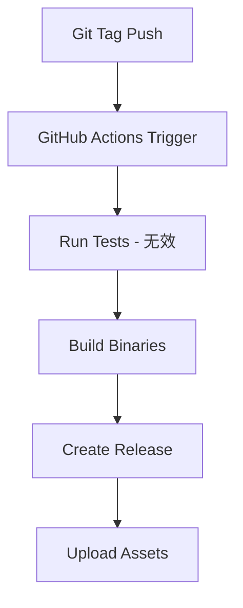
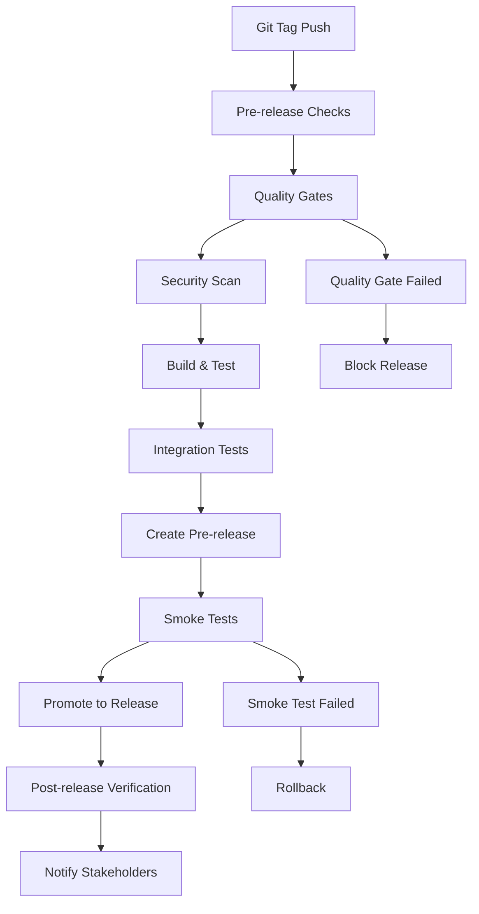

# Harpoon项目CI/CD流程审查报告

## 执行摘要

本报告对Harpoon项目的CI/CD流程进行了全面审查，包括GitHub Actions工作流配置分析、自动化测试执行评估、构建和发布流程审查，以及CI/CD改进机会识别。项目具备基础的CI/CD框架，但在测试自动化、质量门控制和发布流程方面存在显著改进空间。

## 1. GitHub Actions工作流配置分析

### 1.1 测试工作流分析 (`.github/workflows/test.yml`)

#### 工作流配置详情

```yaml
name: Test
on:
  push:
    branches: [ main, develop ]
  pull_request:
    branches: [ main, develop ]

jobs:
  test:
    runs-on: ubuntu-latest
    steps:
    - uses: actions/checkout@v4
    - name: Set up Go
      uses: actions/setup-go@v4
      with:
        go-version: '1.21'
    - name: Run tests
      run: go test -v ./...
    - name: Build
      run: go build -v ./cmd/hpn
```

#### ✅ 优势分析

1. **触发条件合理**：
   - 在主要分支（main, develop）的push事件触发
   - PR事件触发，确保代码合并前的质量检查
   - 覆盖了主要的开发工作流场景

2. **基础配置正确**：
   - 使用最新的GitHub Actions版本（v4）
   - Go版本固定为1.21，确保构建环境一致性
   - 包含基本的构建验证步骤

3. **工作流结构清晰**：
   - 步骤逻辑合理：检出代码 → 设置环境 → 测试 → 构建
   - 命名规范，易于理解和维护

#### ❌ 问题识别

1. **测试执行无效**：
   ```bash
   # 当前命令：go test -v ./...
   # 问题：由于项目中没有任何*_test.go文件，此命令实际不执行任何测试
   # 结果：CI显示"测试通过"，但实际上没有进行任何测试验证
   ```

2. **单一环境限制**：
   - 只在ubuntu-latest上测试
   - 缺少多操作系统兼容性验证
   - 缺少多Go版本兼容性测试

3. **缺少质量检查**：
   - 没有代码覆盖率检查
   - 没有静态分析工具集成
   - 没有代码格式化验证

4. **缺少缓存优化**：
   - 没有Go模块缓存
   - 没有构建缓存
   - 每次都重新下载依赖

#### 改进建议

```yaml
name: Test
on:
  push:
    branches: [ main, develop ]
  pull_request:
    branches: [ main, develop ]

jobs:
  test:
    strategy:
      matrix:
        os: [ubuntu-latest, macos-latest, windows-latest]
        go-version: ['1.20', '1.21']
    
    runs-on: ${{ matrix.os }}
    
    steps:
    - uses: actions/checkout@v4
    
    - name: Set up Go
      uses: actions/setup-go@v4
      with:
        go-version: ${{ matrix.go-version }}
        cache: true
    
    - name: Verify dependencies
      run: go mod verify
    
    - name: Check formatting
      run: |
        gofmt -l . | tee /tmp/gofmt.out
        test ! -s /tmp/gofmt.out
    
    - name: Vet check
      run: go vet ./...
    
    - name: Lint check
      uses: golangci/golangci-lint-action@v3
      with:
        version: latest
    
    - name: Run tests
      run: go test -v -race -coverprofile=coverage.out ./...
    
    - name: Check test coverage
      run: |
        go tool cover -func=coverage.out | grep total | awk '{print $3}' | sed 's/%//' | awk '{if($1<75) exit 1}'
    
    - name: Upload coverage to Codecov
      uses: codecov/codecov-action@v3
      with:
        file: ./coverage.out
    
    - name: Build
      run: go build -v ./cmd/hpn
    
    - name: Test installation
      run: |
        ./hpn --version
        ./hpn --help
```

### 1.2 发布工作流分析 (`.github/workflows/release.yml`)

#### 工作流配置详情

```yaml
name: Release
on:
  push:
    tags:
      - 'v*'

jobs:
  release:
    runs-on: ubuntu-latest
    steps:
    - uses: actions/checkout@v4
    - name: Set up Go
      uses: actions/setup-go@v4
      with:
        go-version: '1.21'
    - name: Run tests
      run: go test -v ./...
    - name: Build binaries
      run: |
        # 多平台构建逻辑
    - name: Create Release
      uses: softprops/action-gh-release@v1
      with:
        files: dist/*
        generate_release_notes: true
      env:
        GITHUB_TOKEN: ${{ secrets.GITHUB_TOKEN }}
```

#### ✅ 优势分析

1. **发布触发机制合理**：
   - 基于Git标签触发，符合语义化版本控制
   - 自动化发布流程，减少人工错误

2. **多平台构建支持**：
   - 支持Linux (amd64, arm64)
   - 支持macOS (amd64, arm64)
   - 支持Windows (amd64)
   - 覆盖主要目标平台

3. **版本信息注入**：
   ```bash
   LDFLAGS="-s -w"
   LDFLAGS="${LDFLAGS} -X github.com/harpoon/hpn/internal/version.Version=${VERSION}"
   LDFLAGS="${LDFLAGS} -X github.com/harpoon/hpn/internal/version.GitCommit=${COMMIT}"
   LDFLAGS="${LDFLAGS} -X github.com/harpoon/hpn/internal/version.BuildDate=${BUILD_DATE}"
   ```
   - 正确注入版本信息
   - 包含构建时间和提交信息

4. **自动发布功能**：
   - 自动创建GitHub Release
   - 自动生成发布说明
   - 自动上传构建产物

#### ❌ 问题识别

1. **质量门缺失**：
   - 发布前的测试同样无效（没有测试文件）
   - 没有最低测试覆盖率要求
   - 没有安全扫描

2. **构建验证不足**：
   - 没有验证构建产物的完整性
   - 没有校验和生成
   - 没有签名验证

3. **发布流程单一**：
   - 没有预发布环境验证
   - 没有回滚机制
   - 没有发布后验证

4. **缺少通知机制**：
   - 没有发布成功/失败通知
   - 没有团队协作通知

#### 改进建议

```yaml
name: Release
on:
  push:
    tags:
      - 'v*'

jobs:
  test:
    runs-on: ubuntu-latest
    steps:
    - uses: actions/checkout@v4
    - name: Set up Go
      uses: actions/setup-go@v4
      with:
        go-version: '1.21'
        cache: true
    
    - name: Run comprehensive tests
      run: |
        go test -v -race -coverprofile=coverage.out ./...
        go tool cover -func=coverage.out | grep total | awk '{print $3}' | sed 's/%//' | awk '{if($1<80) exit 1}'
    
    - name: Security scan
      uses: securecodewarrior/github-action-gosec@master
      with:
        args: '-fmt sarif -out gosec.sarif ./...'
    
    - name: Upload SARIF file
      uses: github/codeql-action/upload-sarif@v2
      with:
        sarif_file: gosec.sarif

  build:
    needs: test
    runs-on: ubuntu-latest
    outputs:
      hashes: ${{ steps.hash.outputs.hashes }}
    
    steps:
    - uses: actions/checkout@v4
    - name: Set up Go
      uses: actions/setup-go@v4
      with:
        go-version: '1.21'
        cache: true
    
    - name: Build binaries
      run: |
        # 构建逻辑（与现有相同）
    
    - name: Generate checksums
      id: hash
      run: |
        cd dist
        sha256sum * > checksums.txt
        echo "hashes=$(cat checksums.txt | base64 -w0)" >> "$GITHUB_OUTPUT"
    
    - name: Upload artifacts
      uses: actions/upload-artifact@v3
      with:
        name: binaries
        path: dist/

  release:
    needs: [test, build]
    runs-on: ubuntu-latest
    permissions:
      contents: write
    
    steps:
    - name: Download artifacts
      uses: actions/download-artifact@v3
      with:
        name: binaries
        path: dist/
    
    - name: Create Release
      uses: softprops/action-gh-release@v1
      with:
        files: dist/*
        generate_release_notes: true
        draft: false
        prerelease: ${{ contains(github.ref, 'alpha') || contains(github.ref, 'beta') || contains(github.ref, 'rc') }}
      env:
        GITHUB_TOKEN: ${{ secrets.GITHUB_TOKEN }}
    
    - name: Notify team
      if: always()
      uses: 8398a7/action-slack@v3
      with:
        status: ${{ job.status }}
        text: "Release ${{ github.ref }} completed with status: ${{ job.status }}"
      env:
        SLACK_WEBHOOK_URL: ${{ secrets.SLACK_WEBHOOK }}
```

## 2. 自动化测试执行评估

### 2.1 当前测试执行状态

#### 测试命令分析

```bash
# 当前CI中的测试命令
go test -v ./...

# 执行结果分析
$ go test -v ./...
?       github.com/harpoon/hpn/cmd/hpn      [no test files]
?       github.com/harpoon/hpn/internal/config  [no test files]
?       github.com/harpoon/hpn/internal/logger  [no test files]
?       github.com/harpoon/hpn/internal/runtime [no test files]
?       github.com/harpoon/hpn/internal/service [no test files]
?       github.com/harpoon/hpn/internal/version [no test files]
?       github.com/harpoon/hpn/pkg/errors      [no test files]
?       github.com/harpoon/hpn/pkg/types       [no test files]
```

#### 问题严重性评估

1. **虚假的成功状态**：
   - CI显示测试通过（绿色状态）
   - 实际上没有执行任何测试
   - 给开发者错误的质量信心

2. **质量保证缺失**：
   - 代码变更没有自动化验证
   - 回归问题无法及时发现
   - 重构风险极高

3. **开发流程风险**：
   - PR合并缺少质量门控制
   - 发布流程缺少质量验证
   - 生产环境风险增加

### 2.2 测试自动化改进方案

#### 短期改进（立即实施）

1. **添加测试存在性检查**：
   ```yaml
   - name: Check test files exist
     run: |
       if [ $(find . -name "*_test.go" | wc -l) -eq 0 ]; then
         echo "❌ No test files found. Please add tests before merging."
         exit 1
       fi
   ```

2. **设置最低测试覆盖率**：
   ```yaml
   - name: Run tests with coverage
     run: |
       go test -v -coverprofile=coverage.out ./...
       coverage=$(go tool cover -func=coverage.out | grep total | awk '{print $3}' | sed 's/%//')
       echo "Test coverage: ${coverage}%"
       if (( $(echo "$coverage < 50" | bc -l) )); then
         echo "❌ Test coverage ${coverage}% is below minimum 50%"
         exit 1
       fi
   ```

3. **添加基础质量检查**：
   ```yaml
   - name: Quality checks
     run: |
       # 格式化检查
       if [ "$(gofmt -l . | wc -l)" -gt 0 ]; then
         echo "❌ Code is not formatted. Run 'gofmt -w .'"
         gofmt -l .
         exit 1
       fi
       
       # 静态分析
       go vet ./...
       
       # 基础安全检查
       if command -v gosec &> /dev/null; then
         gosec ./...
       fi
   ```

#### 中期改进（1个月内）

1. **完整测试套件集成**：
   ```yaml
   - name: Unit tests
     run: go test -v -race -coverprofile=unit.out ./...
   
   - name: Integration tests
     run: go test -v -tags=integration -coverprofile=integration.out ./...
   
   - name: End-to-end tests
     run: go test -v -tags=e2e -coverprofile=e2e.out ./...
   
   - name: Merge coverage reports
     run: |
       echo "mode: atomic" > coverage.out
       tail -n +2 unit.out >> coverage.out
       tail -n +2 integration.out >> coverage.out
       tail -n +2 e2e.out >> coverage.out
   ```

2. **性能回归测试**：
   ```yaml
   - name: Benchmark tests
     run: |
       go test -bench=. -benchmem -run=^$ ./... | tee benchmark.txt
       
       # 与基线对比（如果存在）
       if [ -f benchmark_baseline.txt ]; then
         benchcmp benchmark_baseline.txt benchmark.txt
       fi
   ```

## 3. 构建和发布流程评估

### 3.1 构建脚本分析 (`build.sh`)

#### 脚本功能评估

```bash
#!/bin/bash
# 构建脚本功能分析

# ✅ 优势
- 支持多种构建模式（current/all/clean）
- 正确的版本信息注入
- 多平台交叉编译支持
- 清晰的输出信息

# ❌ 问题
- 缺少构建前的质量检查
- 没有构建产物验证
- 缺少构建缓存优化
- 没有构建失败处理
```

#### 改进建议

```bash
#!/bin/bash
set -euo pipefail

BINARY_NAME="hpn"
VERSION=$(git describe --tags --always 2>/dev/null || echo "dev")
COMMIT=$(git rev-parse --short HEAD 2>/dev/null || echo "unknown")
BUILD_DATE=$(date -u +"%Y-%m-%dT%H:%M:%SZ")

# 构建前检查
pre_build_checks() {
    echo "🔍 Running pre-build checks..."
    
    # 检查Go版本
    go version
    
    # 检查依赖
    go mod verify
    go mod tidy
    
    # 代码质量检查
    gofmt -l . | tee /tmp/gofmt.out
    if [ -s /tmp/gofmt.out ]; then
        echo "❌ Code is not formatted"
        exit 1
    fi
    
    # 静态分析
    go vet ./...
    
    # 运行测试
    go test -v ./...
    
    echo "✅ Pre-build checks passed"
}

# 构建单个平台
build_platform() {
    local os=$1
    local arch=$2
    local output_name="${BINARY_NAME}-${os}-${arch}"
    
    if [ "$os" = "windows" ]; then
        output_name="${output_name}.exe"
    fi
    
    echo "🔨 Building ${os}/${arch}..."
    
    GOOS=$os GOARCH=$arch go build \
        -ldflags "${LDFLAGS}" \
        -o "dist/${output_name}" \
        ./cmd/hpn
    
    # 验证构建产物
    if [ ! -f "dist/${output_name}" ]; then
        echo "❌ Build failed for ${os}/${arch}"
        exit 1
    fi
    
    # 生成校验和
    cd dist
    sha256sum "${output_name}" >> checksums.txt
    cd ..
    
    echo "✅ Built ${output_name}"
}

# 构建后验证
post_build_verification() {
    echo "🧪 Running post-build verification..."
    
    # 验证版本信息
    if [ -f "dist/${BINARY_NAME}-linux-amd64" ]; then
        version_output=$(./dist/${BINARY_NAME}-linux-amd64 --version)
        if [[ ! "$version_output" =~ "$VERSION" ]]; then
            echo "❌ Version verification failed"
            exit 1
        fi
    fi
    
    echo "✅ Post-build verification passed"
}

# 主构建逻辑
case "${1:-current}" in
    "current")
        pre_build_checks
        mkdir -p dist
        echo "Building for current platform..."
        go build -ldflags "${LDFLAGS}" -o ${BINARY_NAME} ./cmd/hpn
        echo "✅ Built ${BINARY_NAME}"
        ;;
    "all")
        pre_build_checks
        mkdir -p dist
        rm -f dist/checksums.txt
        
        echo "Building for all platforms..."
        build_platform "linux" "amd64"
        build_platform "linux" "arm64"
        build_platform "darwin" "amd64"
        build_platform "darwin" "arm64"
        build_platform "windows" "amd64"
        
        post_build_verification
        echo "✅ Built all platforms"
        ;;
    "clean")
        rm -rf dist/
        rm -f ${BINARY_NAME}*
        echo "✅ Cleaned"
        ;;
    *)
        echo "Usage: $0 [current|all|clean]"
        exit 1
        ;;
esac
```

### 3.2 安装脚本分析 (`install.sh`)

#### 脚本质量评估

```bash
# ✅ 优势分析
- 多平台支持（Linux, macOS）
- 自动平台检测
- 权限处理合理
- 用户体验良好
- 错误处理完善
- 安装验证机制

# ❌ 安全问题
- 缺少下载文件校验
- 没有签名验证
- 缺少HTTPS证书验证
- 临时文件安全性
```

#### 安全改进建议

```bash
#!/bin/bash
set -euo pipefail

# 安全配置
REPO="ghostwritten/harpoon"
BINARY_NAME="hpn"
INSTALL_DIR="/usr/local/bin"
VERSION="v1.0"

# 安全下载函数
secure_download() {
    local url=$1
    local output=$2
    local expected_checksum=$3
    
    echo "🔒 Securely downloading from: $url"
    
    # 使用curl进行安全下载
    if command -v curl >/dev/null 2>&1; then
        curl -fsSL \
            --proto '=https' \
            --tlsv1.2 \
            --cert-status \
            --connect-timeout 30 \
            --max-time 300 \
            -o "$output" \
            "$url"
    else
        echo "❌ curl is required for secure download"
        exit 1
    fi
    
    # 验证校验和
    if [ -n "$expected_checksum" ]; then
        echo "🔍 Verifying checksum..."
        local actual_checksum=$(sha256sum "$output" | cut -d' ' -f1)
        if [ "$actual_checksum" != "$expected_checksum" ]; then
            echo "❌ Checksum verification failed"
            echo "Expected: $expected_checksum"
            echo "Actual:   $actual_checksum"
            exit 1
        fi
        echo "✅ Checksum verified"
    fi
}

# 获取校验和
get_checksum() {
    local platform=$1
    local checksums_url="https://github.com/${REPO}/releases/download/${VERSION}/checksums.txt"
    local temp_checksums=$(mktemp)
    
    secure_download "$checksums_url" "$temp_checksums" ""
    
    local checksum=$(grep "hpn-${platform}" "$temp_checksums" | cut -d' ' -f1)
    rm -f "$temp_checksums"
    
    echo "$checksum"
}

# 主安装函数
install_hpn() {
    local download_url="https://github.com/${REPO}/releases/download/${VERSION}/hpn-${PLATFORM}"
    local temp_dir=$(mktemp -d)
    local temp_file="${temp_dir}/hpn"
    
    # 获取预期校验和
    local expected_checksum=$(get_checksum "$PLATFORM")
    
    # 安全下载
    secure_download "$download_url" "$temp_file" "$expected_checksum"
    
    # 验证文件类型
    if ! file "$temp_file" | grep -q "executable"; then
        echo "❌ Downloaded file is not an executable"
        exit 1
    fi
    
    # 安装
    echo "📦 Installing to ${INSTALL_DIR}..."
    if [ -w "$INSTALL_DIR" ]; then
        cp "$temp_file" "${INSTALL_DIR}/${BINARY_NAME}"
        chmod +x "${INSTALL_DIR}/${BINARY_NAME}"
    else
        sudo cp "$temp_file" "${INSTALL_DIR}/${BINARY_NAME}"
        sudo chmod +x "${INSTALL_DIR}/${BINARY_NAME}"
    fi
    
    # 安全清理
    rm -rf "$temp_dir"
    
    echo "✅ Installation completed securely"
}
```

### 3.3 发布流程完整性评估

#### 当前发布流程



#### 问题分析

1. **质量门缺失**：
   - 测试步骤无效
   - 没有代码质量检查
   - 没有安全扫描

2. **发布验证不足**：
   - 没有构建产物验证
   - 没有安装测试
   - 没有功能验证

3. **回滚机制缺失**：
   - 没有发布失败处理
   - 没有自动回滚
   - 没有手动回滚流程

#### 改进的发布流程



## 4. CI/CD改进机会识别

### 4.1 短期改进机会（1-2周）

#### 1. 测试有效性修复

**优先级：紧急**

```yaml
# 立即添加到现有工作流
- name: Validate test existence
  run: |
    if [ $(find . -name "*_test.go" | wc -l) -eq 0 ]; then
      echo "❌ No test files found. CI should not pass without tests."
      echo "Please add test files before merging."
      exit 1
    fi

- name: Run tests with validation
  run: |
    # 确保测试实际运行
    go test -v ./... 2>&1 | tee test_output.log
    if grep -q "no test files" test_output.log; then
      echo "❌ No tests were actually executed"
      exit 1
    fi
```

#### 2. 基础质量检查集成

**优先级：高**

```yaml
- name: Code quality checks
  run: |
    # 格式化检查
    gofmt -l . | tee /tmp/gofmt.out
    test ! -s /tmp/gofmt.out
    
    # 静态分析
    go vet ./...
    
    # 依赖验证
    go mod verify
    go mod tidy
    git diff --exit-code go.mod go.sum
```

#### 3. 构建缓存优化

**优先级：中**

```yaml
- name: Set up Go
  uses: actions/setup-go@v4
  with:
    go-version: '1.21'
    cache: true  # 启用Go模块缓存

- name: Cache build artifacts
  uses: actions/cache@v3
  with:
    path: |
      ~/.cache/go-build
      ~/go/pkg/mod
    key: ${{ runner.os }}-go-${{ hashFiles('**/go.sum') }}
    restore-keys: |
      ${{ runner.os }}-go-
```

### 4.2 中期改进机会（1个月）

#### 1. 多环境测试矩阵

```yaml
strategy:
  matrix:
    os: [ubuntu-latest, macos-latest, windows-latest]
    go-version: ['1.20', '1.21']
    include:
      - os: ubuntu-latest
        go-version: '1.21'
        coverage: true
  fail-fast: false
```

#### 2. 安全扫描集成

```yaml
- name: Security scan
  uses: securecodewarrior/github-action-gosec@master
  with:
    args: '-fmt sarif -out gosec.sarif ./...'

- name: Upload SARIF file
  uses: github/codeql-action/upload-sarif@v2
  with:
    sarif_file: gosec.sarif

- name: Dependency vulnerability scan
  uses: sonatypecommunity/nancy-github-action@main
```

#### 3. 性能回归检测

```yaml
- name: Benchmark tests
  run: |
    go test -bench=. -benchmem -count=5 ./... | tee benchmark.txt

- name: Performance regression check
  uses: benchmark-action/github-action-benchmark@v1
  with:
    tool: 'go'
    output-file-path: benchmark.txt
    github-token: ${{ secrets.GITHUB_TOKEN }}
    auto-push: true
    alert-threshold: '200%'
    comment-on-alert: true
```

### 4.3 长期改进机会（2-3个月）

#### 1. 完整的测试流水线

```yaml
jobs:
  unit-tests:
    # 单元测试
  
  integration-tests:
    needs: unit-tests
    # 集成测试
  
  e2e-tests:
    needs: integration-tests
    # 端到端测试
  
  performance-tests:
    needs: unit-tests
    # 性能测试
  
  security-tests:
    needs: unit-tests
    # 安全测试
```

#### 2. 多阶段发布流程

```yaml
jobs:
  pre-release:
    # 预发布构建和测试
  
  staging-deployment:
    needs: pre-release
    # 部署到测试环境
  
  staging-tests:
    needs: staging-deployment
    # 测试环境验证
  
  production-release:
    needs: staging-tests
    # 生产发布
  
  post-release-verification:
    needs: production-release
    # 发布后验证
```

#### 3. 监控和告警集成

```yaml
- name: Release notification
  if: always()
  uses: 8398a7/action-slack@v3
  with:
    status: ${{ job.status }}
    fields: repo,message,commit,author,action,eventName,ref,workflow
  env:
    SLACK_WEBHOOK_URL: ${{ secrets.SLACK_WEBHOOK }}

- name: Update monitoring dashboard
  run: |
    # 更新发布监控仪表板
    curl -X POST "$MONITORING_WEBHOOK" \
      -H "Content-Type: application/json" \
      -d '{"version": "${{ github.ref }}", "status": "released"}'
```

## 5. 最佳实践建议

### 5.1 CI/CD最佳实践

#### 1. 质量门控制

```yaml
# 设置严格的质量门
quality_gates:
  - test_coverage: ">= 80%"
  - security_scan: "no_high_vulnerabilities"
  - performance: "no_regression"
  - code_quality: "grade_A"
```

#### 2. 渐进式部署

```yaml
# 实现蓝绿部署或金丝雀发布
deployment_strategy:
  type: "blue_green"
  health_check:
    endpoint: "/health"
    timeout: "30s"
  rollback:
    automatic: true
    threshold: "error_rate > 5%"
```

#### 3. 可观测性

```yaml
# 添加构建和部署监控
observability:
  metrics:
    - build_duration
    - test_duration
    - deployment_frequency
    - lead_time
  alerts:
    - build_failure
    - test_failure
    - deployment_failure
```

### 5.2 安全最佳实践

#### 1. 密钥管理

```yaml
# 使用GitHub Secrets管理敏感信息
secrets:
  - DOCKER_REGISTRY_TOKEN
  - SLACK_WEBHOOK_URL
  - CODECOV_TOKEN
  - SIGNING_KEY

# 最小权限原则
permissions:
  contents: read
  security-events: write
  actions: read
```

#### 2. 供应链安全

```yaml
# 依赖验证和锁定
- name: Verify dependencies
  run: |
    go mod verify
    go list -json -m all | nancy sleuth

# 构建产物签名
- name: Sign artifacts
  uses: sigstore/cosign-installer@v3
  with:
    cosign-release: 'v2.0.0'
- run: cosign sign-blob --bundle cosign.bundle dist/*
```

## 6. 实施路线图

### 6.1 第一阶段（立即实施）

**时间：1-2周**

1. **修复测试有效性**：
   - 添加测试文件存在性检查
   - 修复虚假的测试通过状态
   - 设置基础质量门

2. **基础质量检查**：
   - 集成gofmt检查
   - 添加go vet静态分析
   - 启用Go模块缓存

3. **构建优化**：
   - 改进构建脚本错误处理
   - 添加构建产物验证
   - 生成校验和文件

### 6.2 第二阶段（1个月内）

**时间：2-4周**

1. **多环境测试**：
   - 实现测试矩阵
   - 添加多平台兼容性测试
   - 集成代码覆盖率报告

2. **安全扫描**：
   - 集成gosec安全扫描
   - 添加依赖漏洞检查
   - 实现SARIF报告上传

3. **发布流程改进**：
   - 添加预发布验证
   - 实现发布通知
   - 建立回滚机制

### 6.3 第三阶段（2-3个月）

**时间：1-2个月**

1. **完整测试流水线**：
   - 实现集成测试
   - 添加端到端测试
   - 建立性能基准测试

2. **高级部署策略**：
   - 实现多阶段发布
   - 添加自动回滚
   - 建立监控告警

3. **可观测性**：
   - 实现构建监控
   - 添加性能监控
   - 建立质量趋势分析

## 7. 成功指标

### 7.1 质量指标

- **测试覆盖率**：从0%提升到80%+
- **构建成功率**：维持在95%+
- **发布频率**：支持每周发布
- **平均修复时间**：<2小时

### 7.2 效率指标

- **构建时间**：<5分钟
- **测试执行时间**：<10分钟
- **发布时间**：<30分钟
- **回滚时间**：<5分钟

### 7.3 安全指标

- **高危漏洞**：0个
- **中危漏洞**：<5个
- **依赖更新频率**：每月
- **安全扫描覆盖率**：100%

## 8. 结论

**当前CI/CD状况评估：**
- **基础框架完整**：具备基本的CI/CD结构
- **质量保证缺失**：测试和质量检查无效
- **安全性不足**：缺少安全扫描和验证
- **可扩展性良好**：架构支持进一步改进

**关键改进需求：**
1. **紧急**：修复测试有效性，建立真正的质量门
2. **高优先级**：集成代码质量和安全检查
3. **中优先级**：实现多环境测试和发布优化
4. **低优先级**：建立完整的可观测性和监控

**预期改进效果：**
- 显著提高发布质量
- 降低生产环境风险
- 提升开发效率
- 增强团队信心

项目的CI/CD基础良好，通过系统性改进可以建立起现代化的DevOps流程，确保代码质量和发布可靠性。