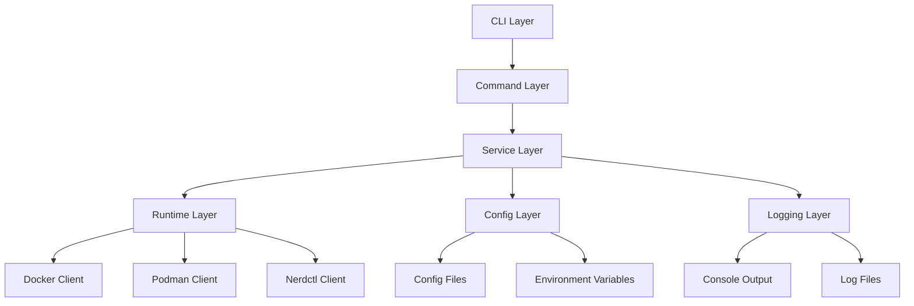

# Design Document

## Overview

The Harpoon Go rewrite (`hpn`) is a modern container image management CLI tool that replaces the existing shell script implementation. The tool provides comprehensive container image operations (pull, save, load, push) with enhanced performance, reliability, and user experience. The design follows Go best practices with a modular architecture that supports multiple container runtimes and flexible operation modes.

## Architecture

### High-Level Architecture



### Package Structure

```
cmd/hpn/
├── main.go                 # Application entry point
├── root.go                 # Root command setup
├── pull.go                 # Pull command implementation
├── save.go                 # Save command implementation
├── load.go                 # Load command implementation
└── push.go                 # Push command implementation

internal/
├── config/
│   ├── config.go          # Configuration management
│   └── validation.go      # Config validation
├── runtime/
│   ├── interface.go       # Runtime interface definition
│   ├── docker.go          # Docker implementation
│   ├── podman.go          # Podman implementation
│   ├── nerdctl.go         # Nerdctl implementation
│   └── detector.go        # Runtime auto-detection
├── service/
│   ├── image.go           # Core image operations
│   ├── pull.go            # Pull service logic
│   ├── save.go            # Save service logic
│   ├── load.go            # Load service logic
│   └── push.go            # Push service logic
├── logger/
│   ├── logger.go          # Logging interface and setup
│   └── formatter.go       # Log formatting
└── utils/
    ├── file.go            # File operations
    ├── parallel.go        # Parallel processing
    └── validation.go      # Input validation

pkg/
├── types/
│   ├── image.go           # Image data structures
│   ├── config.go          # Configuration types
│   └── operation.go       # Operation result types
└── errors/
    └── errors.go          # Custom error types
```

## Components and Interfaces

### 1. CLI Layer (Cobra Framework)

The CLI layer uses the Cobra framework for command-line interface management:

```go
type Command struct {
    Use     string
    Short   string
    Long    string
    RunE    func(cmd *cobra.Command, args []string) error
    PreRunE func(cmd *cobra.Command, args []string) error
}
```

**Key Features:**
- Structured command hierarchy with subcommands
- Flag parsing and validation
- Help generation and usage information
- Command completion support

### 2. Configuration Management

```go
type Config struct {
    Registry    string            `yaml:"registry" json:"registry"`
    Project     string            `yaml:"project" json:"project"`
    Proxy       ProxyConfig       `yaml:"proxy" json:"proxy"`
    Runtime     RuntimeConfig     `yaml:"runtime" json:"runtime"`
    Logging     LoggingConfig     `yaml:"logging" json:"logging"`
    Parallel    ParallelConfig    `yaml:"parallel" json:"parallel"`
    Modes       ModeConfig        `yaml:"modes" json:"modes"`
}

type ProxyConfig struct {
    HTTP    string `yaml:"http" json:"http"`
    HTTPS   string `yaml:"https" json:"https"`
    Enabled bool   `yaml:"enabled" json:"enabled"`
}
```

**Configuration Priority:**
1. Command-line flags (highest)
2. Environment variables
3. Configuration file
4. Default values (lowest)

### 3. Runtime Interface

```go
type ContainerRuntime interface {
    Name() string
    IsAvailable() bool
    Pull(ctx context.Context, image string, options PullOptions) error
    Save(ctx context.Context, image string, tarPath string) error
    Load(ctx context.Context, tarPath string) error
    Push(ctx context.Context, image string, options PushOptions) error
    Tag(ctx context.Context, source, target string) error
    Version() (string, error)
}

type RuntimeDetector interface {
    DetectAvailable() []ContainerRuntime
    GetPreferred() ContainerRuntime
    GetByName(name string) (ContainerRuntime, error)
}
```

**Runtime Implementations:**
- **DockerRuntime**: Uses Docker CLI commands
- **PodmanRuntime**: Uses Podman CLI commands  
- **NerdctlRuntime**: Uses Nerdctl CLI with insecure registry support

### 4. Service Layer

```go
type ImageService interface {
    Pull(ctx context.Context, req PullRequest) (*OperationResult, error)
    Save(ctx context.Context, req SaveRequest) (*OperationResult, error)
    Load(ctx context.Context, req LoadRequest) (*OperationResult, error)
    Push(ctx context.Context, req PushRequest) (*OperationResult, error)
}

type PullRequest struct {
    Images      []string
    Parallel    int
    ProxyConfig *ProxyConfig
    Retry       RetryConfig
}

type OperationResult struct {
    Success     []string          `json:"success"`
    Failed      []FailedOperation `json:"failed"`
    Duration    time.Duration     `json:"duration"`
    Summary     string            `json:"summary"`
}
```

### 5. Logging System

```go
type Logger interface {
    Info(msg string, fields ...Field)
    Warn(msg string, fields ...Field)
    Error(msg string, fields ...Field)
    Debug(msg string, fields ...Field)
    WithFields(fields ...Field) Logger
}

type LoggingConfig struct {
    Level      string `yaml:"level" json:"level"`
    Format     string `yaml:"format" json:"format"` // "text" or "json"
    File       string `yaml:"file" json:"file"`
    Console    bool   `yaml:"console" json:"console"`
    Timestamp  bool   `yaml:"timestamp" json:"timestamp"`
    Colors     bool   `yaml:"colors" json:"colors"`
}
```

## Data Models

### Image Representation

```go
type Image struct {
    Registry   string `json:"registry"`
    Project    string `json:"project"`
    Name       string `json:"name"`
    Tag        string `json:"tag"`
    FullName   string `json:"full_name"`
    Digest     string `json:"digest,omitempty"`
    Size       int64  `json:"size,omitempty"`
}

func (i *Image) String() string {
    if i.Project != "" {
        return fmt.Sprintf("%s/%s/%s:%s", i.Registry, i.Project, i.Name, i.Tag)
    }
    return fmt.Sprintf("%s/%s:%s", i.Registry, i.Name, i.Tag)
}
```

### Operation Modes

```go
type SaveMode int
type LoadMode int  
type PushMode int

const (
    SaveModeCurrentDir SaveMode = iota + 1  // Save to current directory
    SaveModeImagesDir                       // Save to ./images/
    SaveModeProjectDir                      // Save to ./images/<project>/
)

const (
    LoadModeCurrentDir LoadMode = iota + 1  // Load from current directory
    LoadModeImagesDir                       // Load from ./images/
    LoadModeRecursive                       // Load recursively from ./images/*/
)

const (
    PushModeSimple PushMode = iota + 1      // registry/image:tag
    PushModeProject                         // registry/project/image:tag
    PushModePreserve                        // Preserve original project path
)
```

## Error Handling

### Custom Error Types

```go
type HarpoonError struct {
    Code    ErrorCode `json:"code"`
    Message string    `json:"message"`
    Cause   error     `json:"cause,omitempty"`
    Context map[string]interface{} `json:"context,omitempty"`
}

type ErrorCode int

const (
    ErrRuntimeNotFound ErrorCode = iota + 1000
    ErrImageNotFound
    ErrRegistryAuth
    ErrNetworkTimeout
    ErrInsufficientSpace
    ErrInvalidConfig
    ErrFileOperation
)
```

### Error Handling Strategy

1. **Graceful Degradation**: Continue processing remaining items when individual operations fail
2. **Contextual Errors**: Provide specific error messages with suggested solutions
3. **Retry Logic**: Implement exponential backoff for transient failures
4. **Error Aggregation**: Collect and report all errors at operation completion

## Testing Strategy

### Unit Testing

```go
// Example test structure
func TestImageService_Pull(t *testing.T) {
    tests := []struct {
        name    string
        request PullRequest
        runtime ContainerRuntime
        want    *OperationResult
        wantErr bool
    }{
        {
            name: "successful pull single image",
            request: PullRequest{
                Images: []string{"nginx:latest"},
                Parallel: 1,
            },
            runtime: &MockRuntime{},
            want: &OperationResult{
                Success: []string{"nginx:latest"},
                Failed:  []FailedOperation{},
            },
            wantErr: false,
        },
    }
    
    for _, tt := range tests {
        t.Run(tt.name, func(t *testing.T) {
            // Test implementation
        })
    }
}
```

### Integration Testing

- **Runtime Integration**: Test with actual Docker/Podman/Nerdctl installations
- **File System Operations**: Test save/load operations with real tar files
- **Network Operations**: Test pull/push with test registries
- **Configuration Loading**: Test various configuration scenarios

### End-to-End Testing

- **CLI Command Testing**: Test complete command workflows
- **Multi-Runtime Testing**: Verify behavior across different container runtimes
- **Error Scenario Testing**: Test error handling and recovery
- **Performance Testing**: Validate parallel processing and resource usage

## Performance Considerations

### Parallel Processing

```go
type ParallelProcessor struct {
    maxWorkers   int
    semaphore    chan struct{}
    wg           sync.WaitGroup
    errorHandler func(error)
}

func (p *ParallelProcessor) Process(ctx context.Context, items []string, fn func(string) error) error {
    p.semaphore = make(chan struct{}, p.maxWorkers)
    
    for _, item := range items {
        p.wg.Add(1)
        go func(item string) {
            defer p.wg.Done()
            p.semaphore <- struct{}{}
            defer func() { <-p.semaphore }()
            
            if err := fn(item); err != nil {
                p.errorHandler(err)
            }
        }(item)
    }
    
    p.wg.Wait()
    return nil
}
```

### Resource Management

- **Memory Usage**: Stream processing for large tar files
- **Disk Space**: Pre-flight checks for available space
- **Network Bandwidth**: Configurable concurrent connections
- **CPU Usage**: Adaptive concurrency based on system resources

## Security Considerations

### Authentication

- Support Docker config.json for registry authentication
- Environment variable support for credentials
- Secure credential storage and handling

### Image Verification

```go
type ImageVerifier interface {
    VerifyChecksum(image string, expectedChecksum string) error
    VerifySignature(image string) error
    ValidateSize(image string, maxSize int64) error
}
```

### Network Security

- Proxy support for corporate environments
- TLS certificate validation
- Insecure registry handling with explicit configuration

## Deployment and Distribution

### Binary Distribution

- **Single Binary**: Self-contained executable with no external dependencies
- **Cross-Platform**: Support for Linux, macOS, and Windows
- **Installation**: Package managers (Homebrew, APT, YUM) and direct download

### Configuration Management

- **Default Locations**: `~/.hpn/config.yaml`, `/etc/hpn/config.yaml`
- **Environment Variables**: `HPN_*` prefix for all configuration options
- **Validation**: Comprehensive configuration validation with helpful error messages

This design provides a robust, maintainable, and extensible foundation for the Harpoon Go rewrite while maintaining compatibility with existing workflows and adding significant improvements in performance, reliability, and user experience.