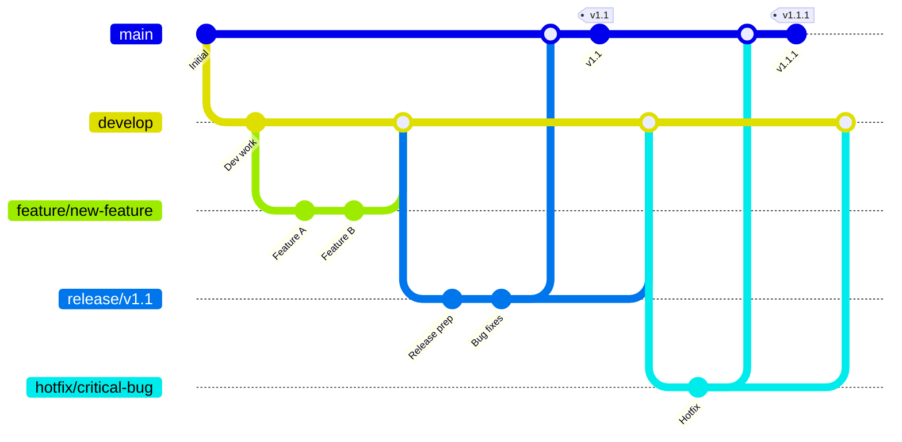
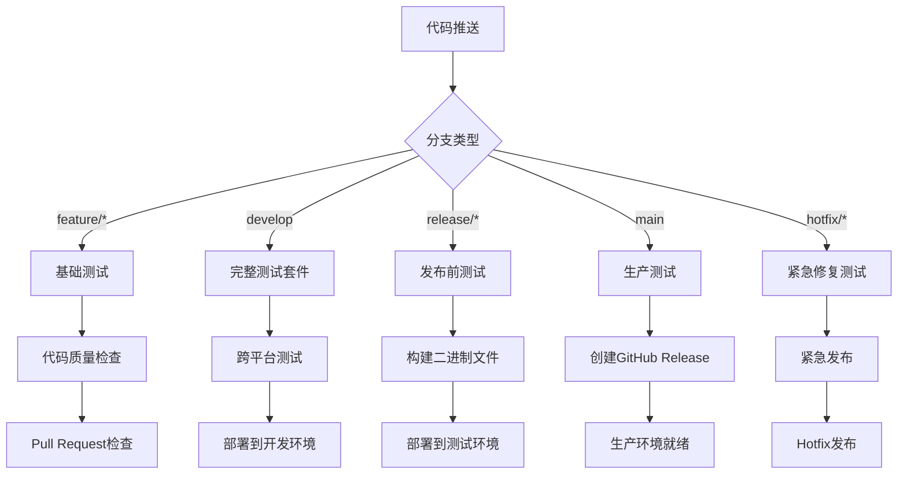
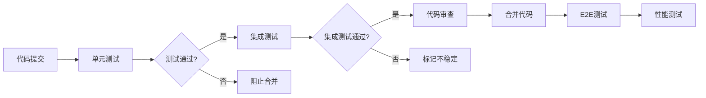

# 发布流程设计文档

## 概述

本设计文档描述了一个完整的从开发到发布的规范流程，适用于已发布v1.0版本的Go项目。该流程基于GitFlow工作流程，结合GitHub Actions进行持续集成和自动化部署，确保代码质量和发布稳定性。

## 架构

### 分支策略



### CI/CD 流水线架构



## 组件和接口

### 1. 分支管理组件

#### 主要分支
- **main**: 生产就绪代码，每个commit对应一个发布版本
- **develop**: 集成分支，包含下一个版本的最新开发代码

#### 支持分支
- **feature/***: 新功能开发分支
- **release/***: 发布准备分支
- **hotfix/***: 紧急修复分支

#### 分支保护规则
```yaml
# .github/branch-protection.yml
main:
  required_status_checks:
    - "test-suite"
    - "build-check"
    - "security-scan"
  required_pull_request_reviews: 2
  dismiss_stale_reviews: true
  require_code_owner_reviews: true

develop:
  required_status_checks:
    - "test-suite"
    - "lint-check"
  required_pull_request_reviews: 1
```

### 2. 持续集成组件

#### 测试流水线
```yaml
# .github/workflows/ci.yml 结构
name: Continuous Integration
on:
  push:
    branches: [ main, develop, 'feature/*', 'release/*', 'hotfix/*' ]
  pull_request:
    branches: [ main, develop ]

jobs:
  test:
    strategy:
      matrix:
        os: [ubuntu-latest, windows-latest, macos-latest]
        go-version: [1.19, 1.20, 1.21]
    
  lint:
    runs-on: ubuntu-latest
    
  security:
    runs-on: ubuntu-latest
    
  build:
    runs-on: ubuntu-latest
```

#### 代码质量检查
- **golangci-lint**: 代码风格和潜在问题检查
- **gosec**: 安全漏洞扫描
- **go test -race**: 竞态条件检测
- **go test -cover**: 测试覆盖率检查

### 3. 发布管理组件

#### 版本管理
```go
// internal/version/version.go
package version

import "fmt"

var (
    Version   = "dev"
    GitCommit = "unknown"
    BuildTime = "unknown"
)

func GetVersion() string {
    return fmt.Sprintf("%s (commit: %s, built: %s)", Version, GitCommit, BuildTime)
}
```

#### 发布流程自动化
```yaml
# .github/workflows/release.yml 结构
name: Release
on:
  push:
    tags: [ 'v*' ]

jobs:
  build:
    strategy:
      matrix:
        goos: [linux, windows, darwin]
        goarch: [amd64, arm64]
        
  release:
    needs: build
    runs-on: ubuntu-latest
```

### 4. 环境管理组件

#### 开发环境
- 自动部署develop分支到开发环境
- 实时日志和监控
- 开发者访问权限

#### 测试环境  
- 自动部署release分支到测试环境
- 完整的集成测试
- QA团队访问权限

#### 生产环境
- 手动触发或自动发布
- 蓝绿部署策略
- 回滚机制

## 数据模型

### 发布配置模型
```yaml
# .release-config.yml
release:
  version_file: "internal/version/version.go"
  changelog_file: "docs/changelog.md"
  release_notes_template: ".github/release-template.md"
  
build:
  targets:
    - os: linux
      arch: amd64
    - os: linux  
      arch: arm64
    - os: windows
      arch: amd64
    - os: darwin
      arch: amd64
    - os: darwin
      arch: arm64
      
quality:
  min_coverage: 80
  required_checks:
    - lint
    - security
    - test
    - build
```

### 工作流状态模型
```go
type WorkflowState struct {
    Branch      string            `json:"branch"`
    Stage       string            `json:"stage"`
    Status      string            `json:"status"`
    Checks      map[string]bool   `json:"checks"`
    Timestamp   time.Time         `json:"timestamp"`
    Metadata    map[string]string `json:"metadata"`
}

type ReleaseState struct {
    Version     string    `json:"version"`
    Branch      string    `json:"branch"`
    Status      string    `json:"status"`
    CreatedAt   time.Time `json:"created_at"`
    ReleasedAt  *time.Time `json:"released_at,omitempty"`
    Artifacts   []string  `json:"artifacts"`
}
```

## 错误处理

### 测试失败处理
1. **单元测试失败**: 阻止合并，要求修复
2. **集成测试失败**: 标记为不稳定，允许开发者选择
3. **跨平台测试失败**: 阻止发布，要求全平台通过

### 构建失败处理
1. **依赖问题**: 自动重试，超时后人工介入
2. **编译错误**: 立即失败，通知开发者
3. **打包失败**: 重试不同环境，记录详细日志

### 部署失败处理
1. **开发环境**: 记录日志，继续流程
2. **测试环境**: 阻止发布流程，要求修复
3. **生产环境**: 自动回滚到上一版本

### 回滚策略
```yaml
rollback:
  automatic_triggers:
    - deployment_failure
    - critical_error_rate > 5%
    - response_time > 5s
  
  manual_triggers:
    - admin_command
    - emergency_procedure
    
  rollback_steps:
    - stop_new_deployments
    - revert_to_previous_version
    - verify_rollback_success
    - notify_stakeholders
```

## 测试策略

### 测试层级

#### 1. 单元测试 (Unit Tests)
- **覆盖率要求**: 最低80%
- **运行频率**: 每次代码推送
- **测试范围**: 所有公共函数和方法
- **工具**: `go test`, `testify`

#### 2. 集成测试 (Integration Tests)
- **测试范围**: 组件间交互
- **运行频率**: PR创建和合并时
- **环境**: 隔离的测试环境
- **工具**: `go test -tags=integration`

#### 3. 端到端测试 (E2E Tests)
- **测试范围**: 完整用户场景
- **运行频率**: 发布前和定期执行
- **环境**: 类生产环境
- **工具**: 自定义测试框架

#### 4. 性能测试 (Performance Tests)
- **测试类型**: 负载测试、压力测试
- **运行频率**: 发布前和主要版本
- **基准**: 与上一版本对比
- **工具**: `go test -bench`, `pprof`

### 测试自动化流程



### 质量门禁

#### Pull Request 质量门禁
- 所有单元测试必须通过
- 代码覆盖率不能降低
- 静态代码分析无严重问题
- 至少一个代码审查批准

#### 发布质量门禁
- 所有测试套件通过
- 安全扫描无高危漏洞
- 性能测试符合基准
- 文档更新完整

## 实施计划

### 阶段1: 基础设施搭建 (1-2周)
1. 配置分支保护规则
2. 设置基础CI/CD流水线
3. 建立测试环境
4. 配置代码质量检查工具

### 阶段2: 自动化测试 (2-3周)
1. 完善单元测试覆盖率
2. 建立集成测试框架
3. 配置跨平台测试
4. 设置性能基准测试

### 阶段3: 发布自动化 (1-2周)
1. 配置自动化构建
2. 设置GitHub Release自动化
3. 建立版本管理机制
4. 配置部署流水线

### 阶段4: 监控和优化 (持续)
1. 建立监控指标
2. 优化流程效率
3. 收集团队反馈
4. 持续改进流程

## 工具和技术栈

### 开发工具
- **版本控制**: Git + GitHub
- **CI/CD**: GitHub Actions
- **代码质量**: golangci-lint, gosec, SonarQube
- **测试**: Go testing, testify, Ginkgo
- **构建**: Go build, GoReleaser

### 监控工具
- **应用监控**: Prometheus + Grafana
- **日志管理**: ELK Stack
- **错误追踪**: Sentry
- **性能分析**: pprof, trace

### 部署工具
- **容器化**: Docker
- **编排**: Kubernetes (可选)
- **包管理**: GitHub Packages
- **文档**: GitHub Pages

## 安全考虑

### 代码安全
- 自动安全扫描 (gosec, Snyk)
- 依赖漏洞检查
- 敏感信息检测
- 代码签名

### 流程安全
- 分支保护和权限控制
- 双人审查制度
- 自动化测试验证
- 审计日志记录

### 发布安全
- 构建环境隔离
- 签名验证
- 安全的密钥管理
- 回滚机制

这个设计为你的Go项目提供了一个完整、可靠的从开发到发布的规范流程，确保代码质量和发布稳定性。