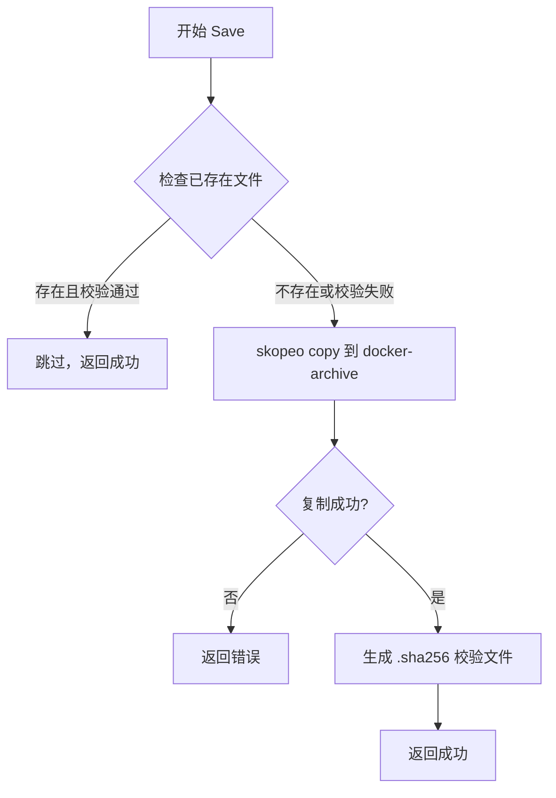
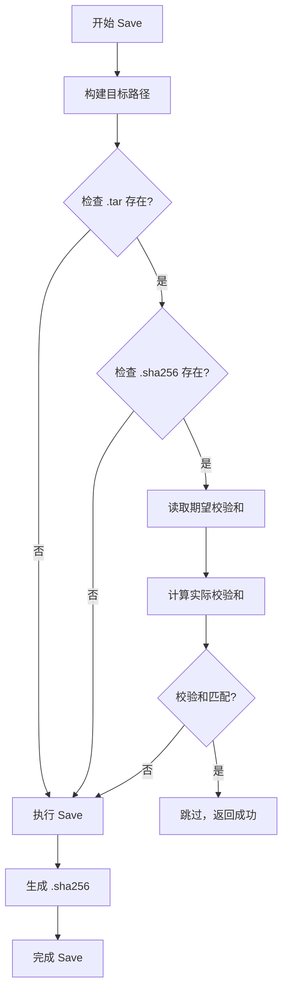

# 集成 Skopeo 支持 pack.sh 核心场景

## 概述

将 pack.sh 的核心功能集成到 hpn 中，通过添加 Skopeo 作为独立的 container runtime，实现批量离线打包、断点续传、多架构支持和企业级需求（日志、校验、资源检查）。

## 核心功能

1. **批量离线打包**：多镜像、压缩、校验
2. **断点续传**：跳过已存在、完整性验证
3. **多架构支持**：保留所有平台变体
4. **企业级需求**：日志、校验、资源检查

## 命令参数影响分析

### 保持不变

- `-a, --action`：保持 pull/save/load/push
- `-f, --file`：镜像列表文件
- `-r, --registry`：目标 registry
- `-p, --project`：项目命名空间
- `-c, --config`：配置文件
- `--save-mode`：保存模式（1/2/3）
- `--load-mode`：加载模式（1/2/3）
- `--push-mode`：推送模式（1/2）
- `--auto-fallback`：自动回退

### 需要扩展

- `--runtime`：新增 `skopeo` 选项（当前：docker|podman|nerdctl）
- `--platform`：支持 `all` 值表示所有架构（当前：linux/amd64, linux/arm64 等）

### 行为变化

- **Save 操作**：所有 runtime 的 save 操作保持 `.tar` 格式，并自动生成 `.sha256` 校验文件用于完整性验证
- **断点续传**：save 操作默认启用，自动跳过已存在且校验通过的镜像（通过检查 `.tar` 和 `.sha256` 文件）
- **多架构**：当 `--platform all` 时，使用 Skopeo 拉取/保存所有架构变体

## 实施计划

### 1. 扩展 Runtime 接口

**文件**: `internal/runtime/interface.go`

- 扩展 `SaveOptions` 结构体（新建），包含：
  - `Checksum bool`：是否生成校验文件（默认 true）
  - `MultiArch bool`：是否支持多架构（仅 Skopeo，当 Platform == "all" 时）
- 修改 `Save` 方法签名：`Save(ctx context.Context, image string, tarPath string, options SaveOptions) error`

### 2. 实现 Skopeo Runtime

**文件**: `internal/runtime/skopeo.go`（新建）

实现 `ContainerRuntime` 接口：

- `Name()`: 返回 "skopeo"
- `IsAvailable()`: 检查 `skopeo` 命令是否可用
- `Pull()`: 使用 `skopeo copy` 命令，支持 `--all` 参数（当 `options.Platform == "all"`）
- `Save()`: 使用 `skopeo copy` 直接保存为 `.tar` 格式（`docker-archive:` 格式），然后生成 `.sha256` 校验文件
- `Load()`: 使用 `skopeo copy` 从 `.tar` 文件加载（`docker-archive:` 格式）
- `Push()`: 使用 `skopeo copy` 推送
- `Tag()`: 使用 `skopeo copy` 实现标签
- `Version()`: 返回 skopeo 版本

**关键实现点**：

- Pull 时：`skopeo copy --preserve-digests --all docker://image dir:path`（当 platform=all）
- Save 时：`skopeo copy --preserve-digests docker://image docker-archive:image.tar` → `sha256sum image.tar > image.tar.sha256`
- 支持代理配置（通过环境变量）
- 多架构支持：当 `--platform all` 时，Save 使用 `--all` 参数保存所有架构

### 3. 更新现有 Runtime 实现

**文件**: `internal/runtime/docker.go`, `podman.go`, `nerdctl.go`

- 修改 `Save` 方法接受 `SaveOptions` 参数
- 实现校验文件生成：`docker/podman/nerdctl save` → 保存为 `.tar` → `sha256sum` 生成 `.sha256` 文件
- 保持向后兼容（如果 options 为空，使用默认值）

### 4. 更新 Runtime Detector

**文件**: `internal/runtime/detector.go`

- 在 `DetectAvailable()` 中添加 `NewSkopeoRuntime()`
- 更新优先级：Docker > Podman > Nerdctl > Skopeo
- 在 `GetByName()` 中支持 "skopeo"

### 5. 扩展 PullOptions

**文件**: `internal/runtime/interface.go`

- 在 `PullOptions` 中添加 `MultiArch bool` 字段（当 `Platform == "all"` 时设置为 true）

### 6. 更新 Save 执行逻辑

**文件**: `cmd/hpn/root.go`

#### 6.1 扩展 platform 参数解析

- 在 `executePull()` 和 `executeSave()` 中支持 `platform == "all"`
- 更新 usage template 说明 `--platform all` 选项

#### 6.2 实现断点续传

- 在 `saveImage()` 函数中添加：
  - 检查目标 `.tar` 文件是否存在
  - 检查对应的 `.sha256` 文件是否存在
  - 验证校验和是否匹配
  - 如果匹配，跳过该镜像并输出提示

#### 6.3 添加校验文件生成

- 修改 `saveImage()` 函数：
  - 所有 runtime 的 save 操作保持 `.tar` 格式
  - 在保存完成后自动生成 `.sha256` 校验文件
  - 校验文件与 tar 文件在同一目录，命名为 `<tarfile>.sha256`

#### 6.4 更新进度显示

- 在跳过已存在镜像时显示 `⏭️ Skipped (already exists and verified)`
- 在生成校验文件时显示相关信息

### 7. 更新配置和文档

**文件**: `cmd/hpn/root.go`

- 更新 usage template，添加：
  - `--runtime` 选项说明包含 `skopeo`
  - `--platform` 选项说明包含 `all` 值
  - 示例命令展示 Skopeo 用法

### 8. 错误处理增强

**文件**: `internal/runtime/skopeo.go`

- 添加 Skopeo 特定的错误处理
- 检查 skopeo 命令输出，提供更友好的错误信息

## 技术细节

### Skopeo Save 流程

### 断点续传逻辑

### 多架构支持

- 当 `--platform all` 时：
  - Pull: `skopeo copy --preserve-digests --all docker://image dir:path`
  - Save: `skopeo copy --preserve-digests --all docker://image docker-archive:image.tar`（保存所有架构变体到同一个 tar 文件）

## 文件清单

### 新建文件

- `internal/runtime/skopeo.go`：Skopeo runtime 实现

### 修改文件

- `internal/runtime/interface.go`：扩展 Save 接口，添加 SaveOptions
- `internal/runtime/detector.go`：添加 Skopeo 检测
- `internal/runtime/docker.go`：更新 Save 方法支持校验文件生成
- `internal/runtime/podman.go`：更新 Save 方法支持校验文件生成
- `internal/runtime/nerdctl.go`：更新 Save 方法支持校验文件生成
- `cmd/hpn/root.go`：实现断点续传、扩展 platform 参数、更新 Save 逻辑

## 测试要点

1. **Skopeo Runtime 检测**：验证 Skopeo 可用性检测
2. **多架构 Pull**：`hpn -a pull -f images.txt --platform all --runtime skopeo`
3. **校验文件生成**：验证所有 runtime 的 save 操作都生成 `.tar` 和 `.sha256` 文件
4. **断点续传**：验证已存在且校验通过的镜像被跳过
5. **向后兼容**：验证现有命令参数和用法仍然有效，文件格式保持 `.tar`

## 注意事项

1. **Skopeo 依赖**：Skopeo 需要单独安装，不在 hpn 中提供
2. **文件格式保持**：Save 操作保持 `.tar` 格式，不进行压缩，避免增加 save 时间
3. **校验文件**：每个 `.tar` 文件对应一个 `.sha256` 校验文件，用于完整性验证和断点续传
4. **Load 操作**：保持现有逻辑，支持加载 `.tar` 格式（Skopeo 使用 `docker-archive:` 格式）
5. **跨平台兼容**：校验文件生成使用 `sha256sum`（Linux）或 `shasum -a 256`（macOS），需要检测平台并选择对应命令
6. **Skopeo 格式**：Skopeo 的 Save 使用 `docker-archive:` 格式，与 Docker/Podman/Nerdctl 的 tar 格式兼容